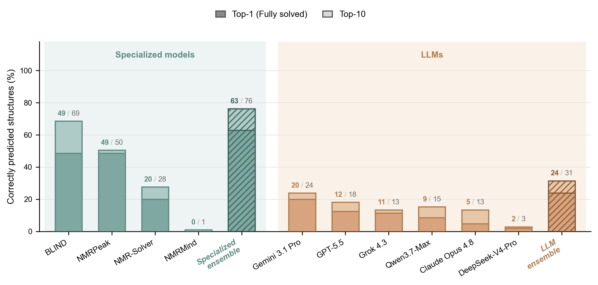

# NMR Benchmark for Structure Elucidation

**Can AI Help Chemists To Solve NMR?** — a benchmark and evaluation pipeline comparing **general-purpose LLMs** and **specialized ML models** on elucidating organic structures from their NMR spectra.

The set contains **105 molecules** across **21 classes** of organic compounds, each paired with experimental **¹H + ¹³C NMR** spectra.



---

## 🔍 Overview

Structure elucidation from NMR — recovering a molecule's structure from its ¹H/¹³C spectra — is a core task in organic chemistry. This repository provides:

- a **curated benchmark** of 105 molecules with clean, single-pair experimental spectra, balanced across 21 functional-group classes and the full molecular-complexity range;
- **ranked SMILES predictions** from ten systems (six general-purpose LLMs and four specialized NMR models), plus two oracle ensembles derived in the analysis (best-of-LLMs and best-of-specialized);
- a **reproducible analysis pipeline** that canonicalizes and structurally matches predictions against ground truth and computes Top-1 / Top-10 accuracy, Tanimoto similarity, functional-group fidelity, and per-class breakdowns.

The benchmark is designed so that a molecule counts as *solved* only when a predicted SMILES is the **same structure** as the truth after RDKit canonicalization — not merely a similar-looking string.

---


## 🗂️ Repository architecture

```
.
├── README.md
├── LICENSE
├── dataset/
│   ├── dataset_selected_clean_105.json         # the benchmark: 105 molecules + ¹H/¹³C spectra
│   ├── complexities_nmr_challenge.json         # complexity scores of the external NMR-Challenge set
│   ├── dataset_preparation.ipynb               # how the benchmark was assembled
│   ├── llm_track.ipynb                         # how the general-purpose LLMs were queried
│   └── predictions_using_local_models.ipynb    # methodology for the specialized models
├── results/
│   ├── combined_predictions_105_final.json     # ranked SMILES from all 10 systems
│   └── LLM_results/
│       ├── llm_final_clean.jsonl               # per-call LLM predictions (parsed candidates)
│       └── llm_final_raw.jsonl                 # per-call LLM predictions (full model output)
└── analysis/
    ├── data_analysis.ipynb                     # main analysis: metrics, comparison, figures
    └── to_article/                             # publication-ready figures (PNG)
```

**Key notebooks**

- [`analysis/data_analysis.ipynb`](analysis/data_analysis.ipynb) — the main analysis. Loads the combined predictions, canonicalizes and structurally matches predicted vs. true SMILES (RDKit), and computes every reported metric and figure.
- [`dataset/dataset_preparation.ipynb`](dataset/dataset_preparation.ipynb) — how the 105-molecule benchmark was built: sourcing from the OdanChem spectral database, spectral curation, molecular-complexity scoring, SMARTS-based classification into 21 classes, and complexity-quintile sampling.
- [`dataset/llm_track.ipynb`](dataset/llm_track.ipynb) — how the six general-purpose LLMs were queried: prompt construction, the OpenRouter sweep (identical settings for every model — temperature 1.0, 24K max tokens, provider-default reasoning), and response parsing into ranked SMILES.
- [`dataset/predictions_using_local_models.ipynb`](dataset/predictions_using_local_models.ipynb) — how the specialized models were run: input preprocessing (shift-token conversion for NMRMind; structured peak objects for NMRPeak) and the model weights used.

---


## 🚀 Quick start

```bash
git clone https://github.com/odanchem/NMRArena.git
cd NMRArena

# Python 3.9+; core dependencies for the analysis pipeline
pip install rdkit pandas numpy matplotlib jupyter
```

Explore the data directly:

```python
import json

data = json.load(open("dataset/dataset_selected_clean_105.json", encoding="utf-8"))
preds = json.load(open("results/combined_predictions_105_final.json", encoding="utf-8"))
```

Reproduce the metrics and figures by running [`analysis/data_analysis.ipynb`](analysis/data_analysis.ipynb) top to bottom.

To re-run the LLM sweep yourself, [`dataset/llm_track.ipynb`](dataset/llm_track.ipynb) additionally needs the OpenRouter client and an API key:

```bash
pip install openai
export OPENROUTER_API_KEY="..."
```

---


## 📁 Dataset

`dataset/dataset_selected_clean_105.json` is nested three levels deep — `class → entry → record`:

```json
{
  "cls_alkanes_haloalkanes": {
    "1.0": {
      "compound_id": "d3dc602d-...",
      "publication_id": "9bbc201d-...",
      "smiles": "CC(CCI)C",
      "n_complex": 0.09,
      "h_nmr": "H_NMR (300 MHz, CDCl3) δ 3.21 (t, J = 7.2 Hz, 2H), ...",
      "c_nmr": "C_NMR (75 MHz, CDCl3) δ 42.6, 29.1, 21.7, 5.4",
      "doi": "10.3762/bjoc.8.14"
    }
  }
}
```


| Field             | Meaning                                    |
| ----------------- | ------------------------------------------ |
| `compound_id`     | unique molecule identifier                 |
| `publication_id`  | source publication identifier              |
| `smiles`          | ground-truth structure                     |
| `n_complex`       | machine-learned molecular-complexity score |
| `h_nmr` / `c_nmr` | experimental ¹H / ¹³C peak lists           |
| `doi`             | DOI of the source publication              |


**Composition** — 105 molecules, 5 per class, across 21 functional-group classes:


|                     | Classes                                                              |
| ------------------- | -------------------------------------------------------------------- |
| Hydrocarbons        | alkanes/haloalkanes · alkenes · alkynes · polyarenes · heteroarenes  |
| Oxygen groups       | alcohols · phenols · ethers · ketones · aldehydes · acids · esters   |
| Nitrogen groups     | amines · amides · nitriles · azides                                  |
| Rings / heteroatoms | small rings · spiro · heterocycles · organophosphorus · sulfur       |


Spectra are curated from **OdanChem**, an open spectral database of >20M experimental NMR spectra, keeping a single trustworthy ¹H/¹³C pair per molecule.

---


## 🧪 Models tested

Each system receives the experimental ¹H and ¹³C peak lists and returns a **best-first ranked list of candidate SMILES**.

### Specialized NMR models


| Model                                          | Execution |
| ---------------------------------------------- | --------- |
| NMRMind                                        | Local     |
| NMRPeak                                        | Local     |
| NMR-Solver                                     | Web       |
| [BLIND](https://github.com/nochemi2k/BLIND)    | Web       |

In `results/combined_predictions_105_final.json` every system is a key on the molecule record. Note that BLIND appears there — and in the analysis notebook — under its internal name `odan_ai`.


### General-purpose LLMs


| Model           | Provider        | Release date |
| --------------- | --------------- | ------------ |
| Gemini 3.1 Pro  | Google DeepMind | 19 Feb 2026  |
| GPT-5.5         | OpenAI          | 23 Apr 2026  |
| DeepSeek-V4-Pro | DeepSeek        | 24 Apr 2026  |
| Grok 4.3        | xAI             | 30 Apr 2026  |
| Qwen3.7-Max     | Alibaba         | 19 May 2026  |
| Claude Opus 4.8 | Anthropic       | 28 May 2026  |


---


## 📈 Results

Accuracy over the 105 molecules. **Top-1** / **Top-10** = fraction whose true structure is recovered within the first 1 / 10 candidates; **Tanimoto** = mean Top-1 similarity (Morgan radius 2 / ECFP4) between the rank-1 candidate and the truth.


| Method                   | Kind        | Top-1 (%) | Top-10 (%) | Tanimoto |
| ------------------------ | ----------- | --------- | ---------- | -------- |
| BLIND                    | specialized | 48.6      | 68.6       | 0.74     |
| NMRPeak                  | specialized | 48.6      | 50.5       | 0.70     |
| NMR-Solver               | specialized | 20.0      | 27.6       | 0.46     |
| Gemini 3.1 Pro           | LLM         | 20.0      | 23.8       | 0.52     |
| GPT-5.5                  | LLM         | 12.4      | 18.1       | 0.43     |
| Grok 4.3                 | LLM         | 11.4      | 13.3       | 0.42     |
| Qwen3.7-Max              | LLM         | 8.6       | 15.2       | 0.41     |
| Claude Opus 4.8          | LLM         | 4.8       | 13.3       | 0.39     |
| DeepSeek-V4-Pro          | LLM         | 1.9       | 2.9        | 0.30     |
| NMRMind                  | specialized | 0.0       | 1.0        | 0.17     |


Specialized models lead on structure elucidation. General-purpose LLMs trail but are far from random.

---


## 📚 Citation

> ⚠️ Placeholder — final citation to be added on publication.

```bibtex
@article{nmr_benchmark_2026,
  title   = {Can AI Help Organic Chemists To Solve NMR?},
  author  = {TBD},
  journal = {TBD},
  year    = {2026},
  doi     = {TBD}
}
```

